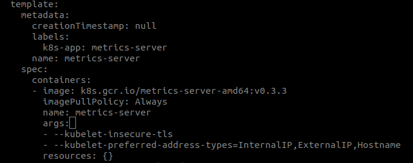

# Kubernetes Metrics Server

## User guide

You can find the user guide in
[the official Kubernetes documentation](https://kubernetes.io/docs/tasks/debug-application-cluster/resource-metrics-pipeline/).

## Design

The detailed design of the project can be found in the following docs:

- [Metrics API](https://github.com/kubernetes/community/blob/master/contributors/design-proposals/instrumentation/resource-metrics-api.md)
- [Metrics Server](https://github.com/kubernetes/community/blob/master/contributors/design-proposals/instrumentation/metrics-server.md)

For the broader view of monitoring in Kubernetes take a look into
[Monitoring architecture](https://github.com/kubernetes/community/blob/master/contributors/design-proposals/instrumentation/monitoring_architecture.md)

## Deployment

Compatibility matrix:

Metrics Server | Metrics API group/version | Supported Kubernetes version
---------------|---------------------------|-----------------------------
0.3.x          | `metrics.k8s.io/v1beta1`  | 1.8+
0.2.x          | `metrics.k8s.io/v1beta1`  | 1.8+
0.1.x          | `metrics/v1alpha1`        | 1.7


In order to deploy metrics-server in your cluster run the following command:

```console
$ kubectl apply -f https://github.com/kubernetes-sigs/metrics-server/releases/download/v0.3.7/components.yaml
```

You can also use this helm chart to deploy the metric-server in your cluster (This isn't supported by the metrics-server maintainers): https://github.com/helm/charts/tree/master/stable/metrics-server

If you want to test `metric-server` in a `minikube` cluster, please follow the steps below:

```console
$ minikube version
minikube version: v1.2.0

# disable the metrics-server addon for minikube in case it was enabled, because it installs the metric-server@v0.2.1
$ minikube addons disable metrics-server

# now start a new minikube
$ minikube delete; minikube start --extra-config=kubelet.authentication-token-webhook=true
🔥  Deleting "minikube" from virtualbox ...
💔  The "minikube" cluster has been deleted.
😄  minikube v1.2.0 on linux (amd64)
🔥  Creating virtualbox VM (CPUs=2, Memory=2048MB, Disk=20000MB) ...
🐳  Configuring environment for Kubernetes v1.15.0 on Docker 18.09.6
    ▪ kubelet.authentication-token-webhook=true
🚜  Pulling images ...
🚀  Launching Kubernetes ...
⌛  Verifying: apiserver proxy etcd scheduler controller dns
🏄  Done! kubectl is now configured to use "minikube"

# deploy the latest metric-server
$ kubectl create -f deploy/1.8+/
clusterrole.rbac.authorization.k8s.io/system:aggregated-metrics-reader created
clusterrolebinding.rbac.authorization.k8s.io/metrics-server:system:auth-delegator created
rolebinding.rbac.authorization.k8s.io/metrics-server-auth-reader created
apiservice.apiregistration.k8s.io/v1beta1.metrics.k8s.io created
serviceaccount/metrics-server created
deployment.extensions/metrics-server created
service/metrics-server created
clusterrole.rbac.authorization.k8s.io/system:metrics-server created
clusterrolebinding.rbac.authorization.k8s.io/system:metrics-server created

# edit metric-server deployment to add the flags
# args:
# - --kubelet-insecure-tls
# - --kubelet-preferred-address-types=InternalIP,ExternalIP,Hostname
$ kubectl edit deploy -n kube-system metrics-server
```


## Flags

Metrics Server supports all the standard Kubernetes API server flags, as
well as the standard Kubernetes `glog` logging flags.  The most
commonly-used ones are:

- `--logtostderr`: log to standard error instead of files in the
  container.  You generally want this on.

- `--v=<X>`: set log verbosity.  It's generally a good idea to run a log
  level 1 or 2 unless you're encountering errors.  At log level 10, large
  amounts of diagnostic information will be reported, include API request
  and response bodies, and raw metric results from Kubelet.

- `--secure-port=<port>`: set the secure port.  If you're not running as
  root, you'll want to set this to something other than the default (port
  443).

- `--tls-cert-file`, `--tls-private-key-file`: the serving certificate and
  key files.  If not specified, self-signed certificates will be
  generated, but it's recommended that you use non-self-signed
  certificates in production.

Additionally, Metrics Server defines a number of flags for configuring its
behavior:

- `--metric-resolution=<duration>`: the interval at which metrics will be
  scraped from Kubelets (defaults to 60s).

- `--kubelet-insecure-tls`: skip verifying Kubelet CA certificates.  Not
  recommended for production usage, but can be useful in test clusters
  with self-signed Kubelet serving certificates.

- `--kubelet-port`: the port to use to connect to the Kubelet (defaults to
  the default secure Kubelet port, 10250).

- `--kubelet-preferred-address-types`: the order in which to consider
  different Kubelet node address types when connecting to Kubelet.
  Functions similarly to the flag of the same name on the API server.
